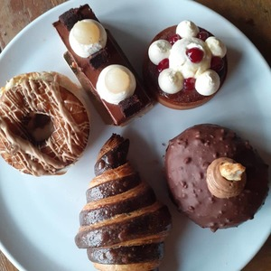

# Doggie Dining

I chose to do my second project on a webpage that shows dog friendly restaurants in Ireland.


# UX

## Planes Of Scope

**Strategy Plane**

* I thought of what the web page should consist of and how to make it user-friendly and easy to navigate through.

**Scope Plane**

* At this stage I decided on what features I would use on my page for the user.

**Structure Plane**

* I decided how I wanted to set up my page and position each element with in it.

**Skeleton Plane**

* I visualized how I wanted my page looking with images to catch users attention to the venue of interest.

**Surface Plane**

* After researching and going through pros and cons, I finally decided how the end result should appear.


## User Stories

**As a dog owner**

* To see places to bring my dog with me to eat.

* Contact the venues been displayed.

* See images of these places.

* Read information & bio about the premises.

**As a business owner**

* Have information displayed for our customers to see.

* Images of our food and dogs.

* Have potential customers contact us.

**As a developer**

* Use Google Maps API.

* Help people looking for pet friendly places to eat.

* Implement the technologies I have been studying.

# Design Choices

**Fonts**

* The font I used for my headings was the "Yusei Magic" font which I found very user-friendly and inviting.

* The font I used for my paragraphs was the "Josefin Sans" font which I thought complimented the "Yusei Magic" font.

* The font colour is black as the background colour of my page is white and the colours are easy to navigate through. The background colour white also makes the images pop out and catch users attention.

**Images**

* The images used were found on the Facebooks of the places used. The white dog in the Cookhouse gallery is mine.

* I used 3 images for each place as odd numbers work well on the eye.

* I went for a mixture of sweet and savoury in the images and also included a dog in each of their venues.

* I designed my logo on [tailorbrands](https://www.tailorbrands.com/logo-maker).

# Styling & Structure

* I chose to do a single web page, I wanted it to be straight to the pint and for users to easily navigate through it.

* The navbar consists of a just the brand logo.

* There is a short header and a paragraph about the webpage.

* Below then there is the Google Maps API with the venues marked.

* There are three places listed on the webpage all with a short bio of the places and also images.

* At the bottom of the page is a footer with a contact email.

# Wire Frames

* The following documents are within my project in a folder labelled wireframes. There were made using Balsamiq during the Scope Plane part of the design and planning process for this project.

# Features

* This web page used the Google Maps API.

* This highlights on the map where the described venues on the page are located.

* It features links to contact these restaurants.

* A linkable email address in the footer to contact the web page.

# Technologies Used

* The languages used in this project were HTML, CSS and JavaScript.

* I used [Balsamiq](https://balsamiq.com/wireframes/?gclid=Cj0KCQiA0-6ABhDMARIsAFVdQv-lThsZDXEXAj-b2GB1kztDqctN5Wbe_Ty0Zbu9Ey-tG5o9MqLrBRAaAu1hEALw_wcB) for wireframes.

* I used [Bootstrap](https://getbootstrap.com/) for the layout and responsiveness of my web page on other devices.

* I used [Tailored Brands](https://studio.tailorbrands.com/brands/free) to make my brand logo.

* I used [Google Maps API](https://cloud.google.com/maps-platform/maps?utm_source=google&utm_medium=cpc&utm_campaign=FY20-Q3-global-demandgen-displayonnetworkhouseads-cs-GMP_maps_contactsal_saf_v2&utm_content=text-ad-none-none-DEV_c-CRE_434785623326-ADGP_Hybrid%20%7C%20AW%20SEM%20%7C%20BKWS%20~%20Brand%20%7C%20EXA%20%7C%20Google%20Maps%20API-KWID_43700053663474825-aud-559916008220%3Akwd-335425467-userloc_1007901&utm_term=KW_google%20maps%20api-ST_google%20maps%20api&gclid=Cj0KCQiA0-6ABhDMARIsAFVdQv_5EpWbZ3f_ZCfVobJzbKedrNtCZQ_EmUICfLfZ8cy3p42F6ePlpFIaAoBYEALw_wcB) to show users the locations.

# Deployment

This project was developed using [GitPod IDE](https://www.gitpod.io/), committed to git and pushed to GitHub using the built-in terminal with in GitPod.

To deploy this page to GitHub pages from its GitHub repository, following steps were taken

1. Log into to **GitHub**.

2. From the list of repositories on the left side, click **SmokeySam/doggie-dining**.

3. Select **Settings** from the menu item located near the top.

4. Scroll down to the **GitHub Pages** section.

5. Under Source click the menu labelled none and select **Master Branch**.

6. After selecting **Master Branch** the page is automatically refreshed, the website is now deployed.

7. Go back to the **GitHub Pages** section to retrieve the link to the deployed website.

## How to run this project locally

To clone this project from GitHub:

1. Click this link to go to the Project GitHub repository.

2. Under the repository name click "Clone or Download."

3. In the clone HTTPS section, copy the clone URL for the repository.

4. In your local IDE open GitBash.

5. Change the current working directory to the location where you want the cloned directory to be made.

6. Type
 ```
 git clone 
 ```
 
 then the URL you copied.

 ```
 git clone https://github.com/SmokeySam/doggie-diner.git
 ```

7. Press Enter. Your local clone will be created.

# Testing

* I tested all links to make sure they are working for the user.

* I tested my code through [W3C Markup Validator](https://validator.w3.org/) and [W3C CSS Validator](https://jigsaw.w3.org/css-validator/) to ensure my code was running smoothly with no errors.

* I tested my JavaScript code through [Esprima](https://esprima.org/demo/validate.html) to check for errors.

# Testing Client User Stories

1. As a dog owner, I want to see restaurants to eat with my dog.

* The Google Maps API locates dog friendly restaurants for you and your dog to eat at.

2. As a dog owner, I want to see pictures and read information of these restaurants.

* Images and bios have been displayed for the user to see.

3. As a dog owner, I want to contact these venues.

* Links have been provided for the user to contact the venue and see their Facebook profiles.

4. As a developer, I want to help dog owners see places where them and their dogs can go to eat.

* I have arranged the web page in a user-friendly way, where the user can find out this information.

5. As a developer, I want to use the technologies I have been studying.

* During the project I have used an API and implemented it on my project. I have used JavaScript and furthered my knowledge on HTML, CSS & other technologies.

# Bugs

* Adding the images to my page under the restaurants section I came across a problem, where on mobile view the images were not lining up centre. White space was occupying the side.

```
<div class="container gallery-images">
            <div class="row">

            <div class="col-lg-4 col-md-6 col-sm-12">
                 
            </div>

            <div class="col-lg-4 col-md-6 col-sm-12">
                
            </div> 

            <div class="col-lg-4 col-md-6 col-sm-12">
                
            </div>

            </div>
            </div>
```

I fixed this by changing the class.

```
<div class="container gallery-images">
            <div class="row">

            <div class="col-lg-4 col-md-6 col-sm-12">
                 
            </div>

            <div class="col-lg-4 col-md-6 col-sm-12">
                
            </div> 

            <div class="col-lg-4 col-md-6 col-sm-12">
                
            </div>

            </div>
            </div>
```

* Adding ```overflow-x: hidden; ``` in my CSS also helped fix this problem.

# Credits

## Content

* All code taken from other sources is documented below with links. Other code is written by myself with snippets or adjustments made upon reading and researching forums. Websites used to gain these pieces of information were [YouTube](https://www.youtube.com/), [Stack Overflow](https://stackoverflow.com/) and [W3Schools](https://www.w3schools.com/).

* **Fonts** were taken from [Google Fonts](https://fonts.google.com/)

* **Navbar & Footer** were styled from [Bootstrap](https://getbootstrap.com/)

* **Map API** was taken from [Google Developers](https://developers.google.com/)

* **Read Me** The structure of my README file was taken from a series of videos offered by The Code Institute.

## Media

* Images were sourced off of Facebook.

* Photo of white dog owned by me.

# Acknowledgements

* I wanted to do this project because I am a dog lover and also a huge foodie! I want this to be a continuous project I can keep updating.


